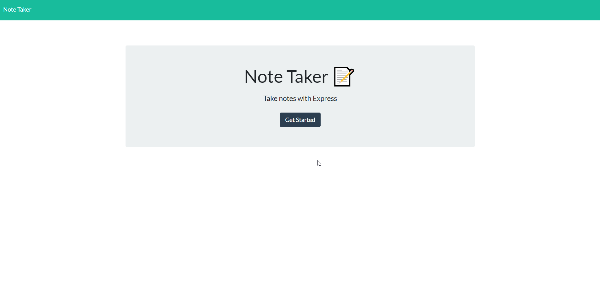
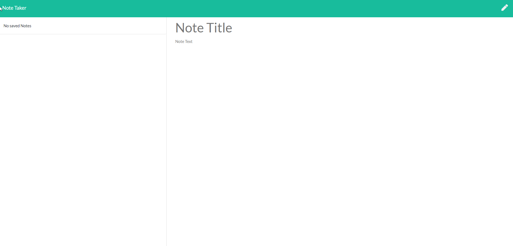
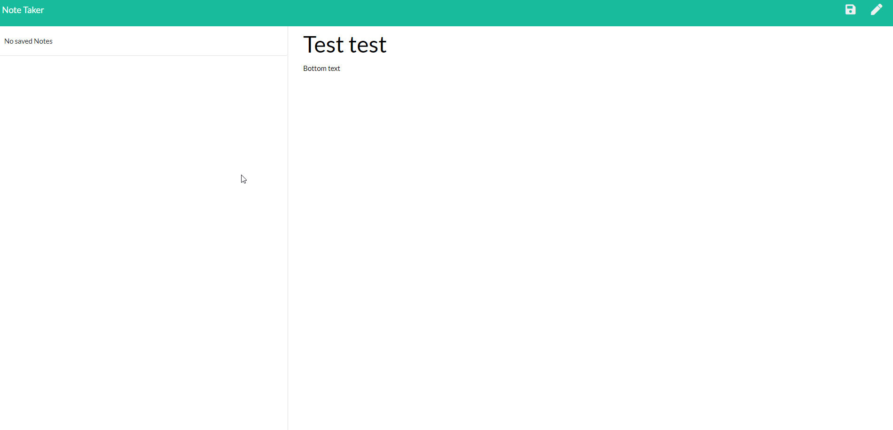
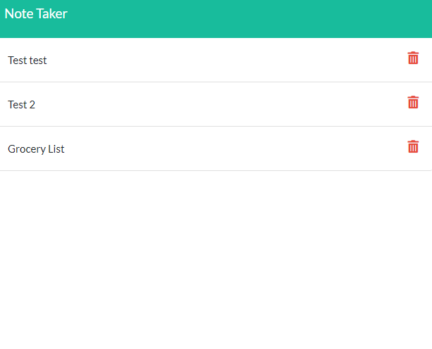
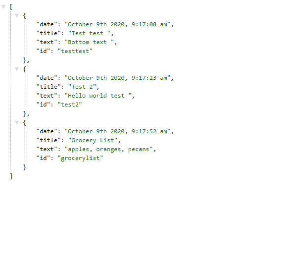

# Note Taker

## Description

This is a note taker app that I have made using Node.js and Express. 

The front-end html, css, and js were downloaded from the class repo. I made minor changes to js and html, but functionally they are the same as they were when I downloaded them. 

Using Express and Node.js, I made a server and used routes to render different files when route-specific requests are made. I have added GET requests that render the index and notes html, and the notes json file. I also added an api/notes/:id route to see specific notes. To do this I had to give the note object an id. I also added a date object that uses Moments.js so users can tell when the note was made for better organization. 

## Links 

Deployed application: https://peaceful-brook-13821.herokuapp.com/  

GitHub Repository: https://github.com/jjbidwell/note-taker

## Screenshots

